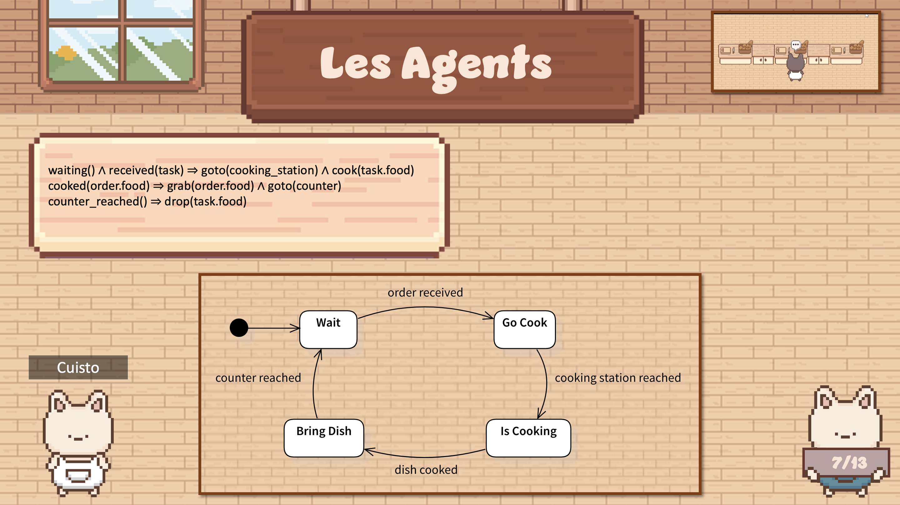

> Le dépôt GitLab est disponible [ici](https://gitlab.com/bunniesbistro/bunnies-bistro).

## Captures d'écran

Voici une capture d'écran du jeu et quelques diapos présentant la logique derrière les agents. Les packs d'_assets_ utilisés sont [300+ Cafe interiors](https://abyssalhunter.itch.io/cafe) et [Mini FX, Items & UI](https://grafxkid.itch.io/mini-fx-items-ui) ainsi que quelques _sprites_ réalisés par nos soins.

