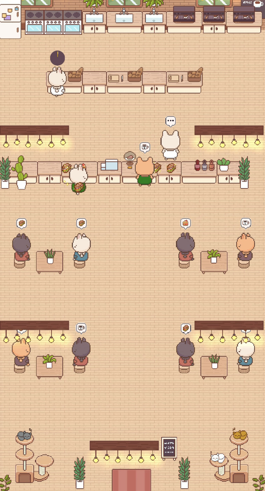
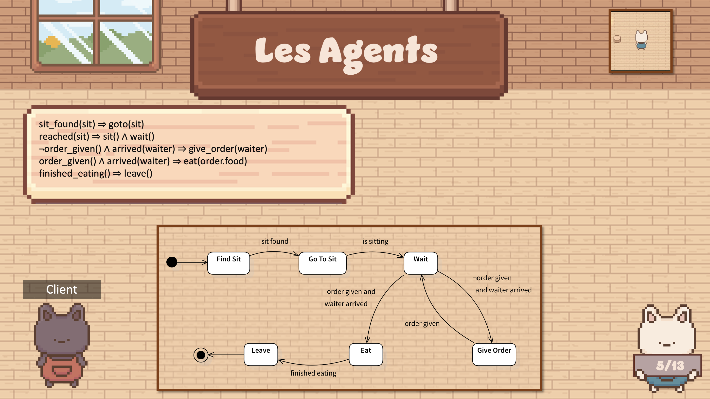
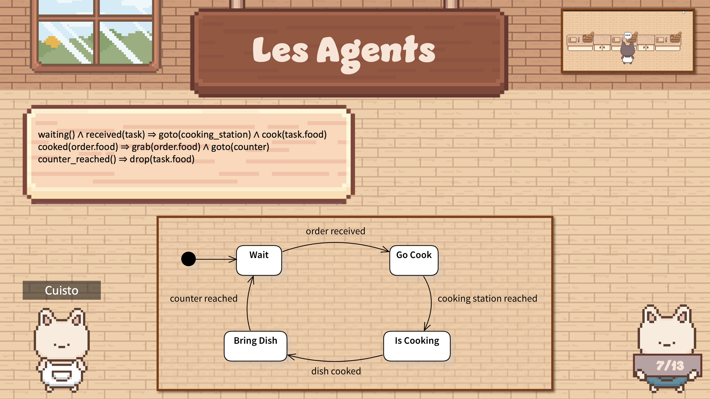
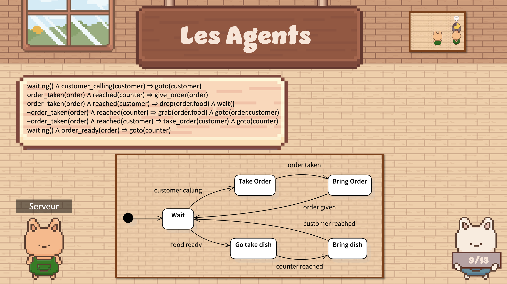
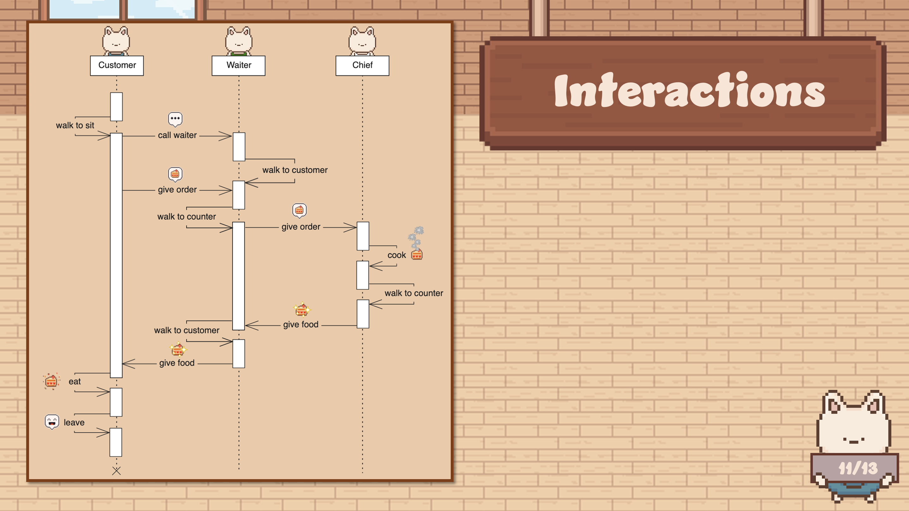

> The associated GitLab repository is available [here](https://gitlab.com/bunniesbistro/bunnies-bistro).

## Screenshots

Here are a screenshot of the game and some slides presenting the logic behind the agents. The asset packs used are [300+ Cafe interiors](https://abyssalhunter.itch.io/cafe) and [Mini FX, Items & UI](https://grafxkid.itch.io/mini-fx-items-ui) as well as some custom sprites.

