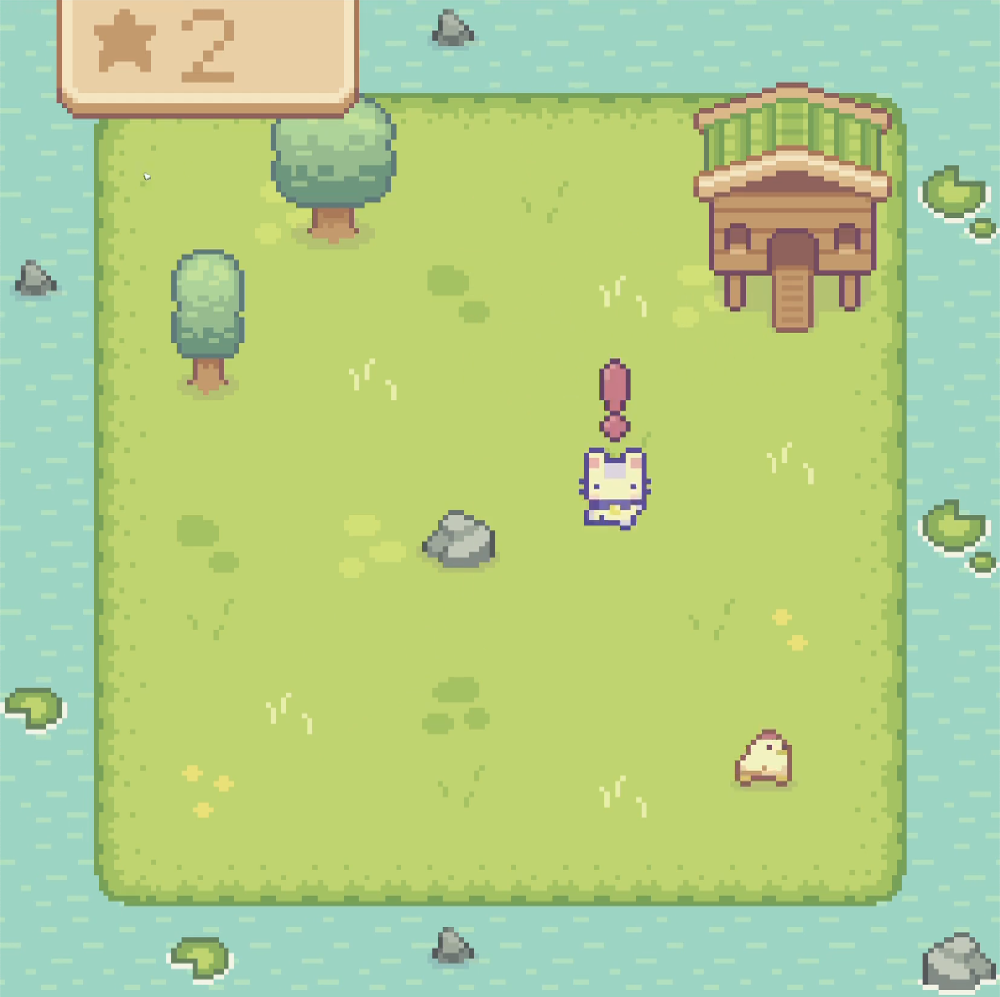
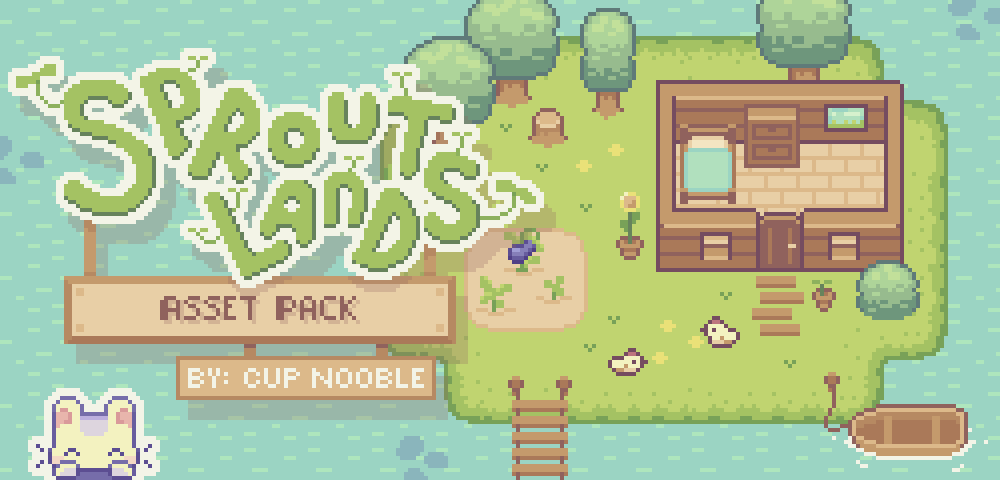

> Le dépôt GitLab est disponible [ici](https://gitlab.com/farmers3/chickenchase).

## Captures d'écran

Voici une capture d'écran du jeu et quelques diapos présentant la logique derrière les agents.

