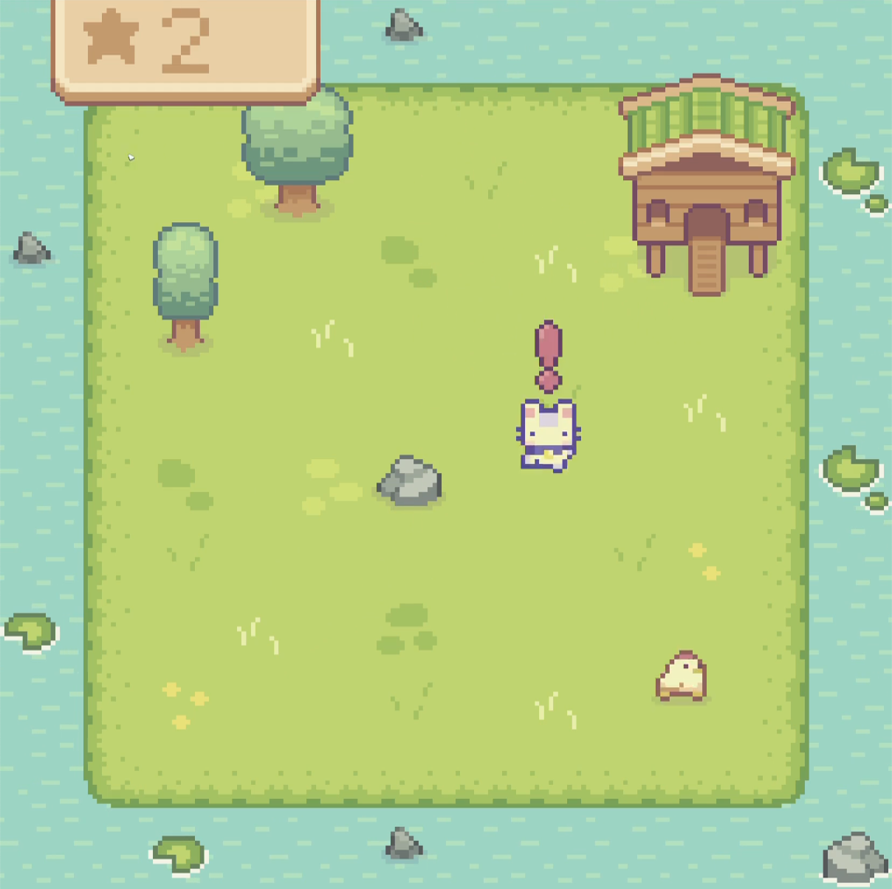
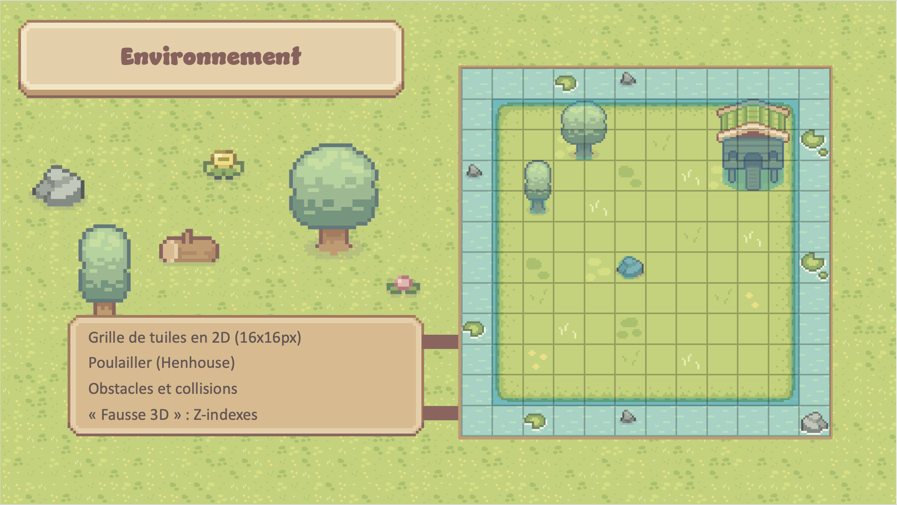
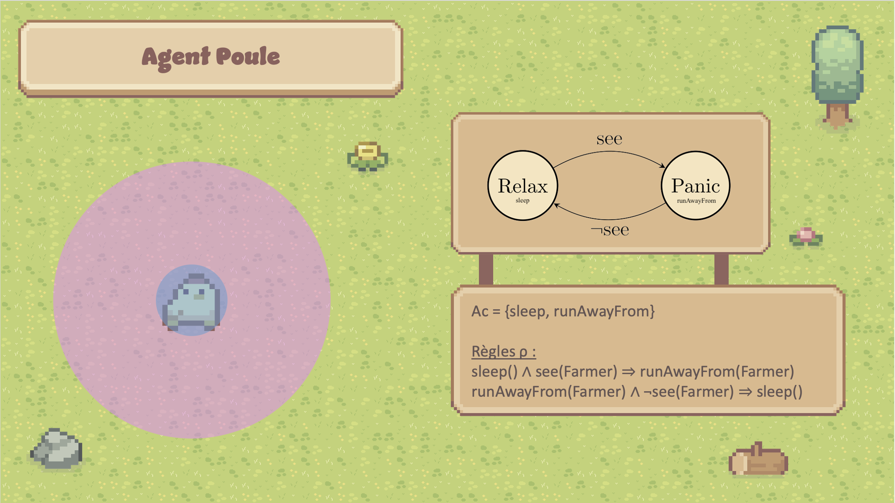
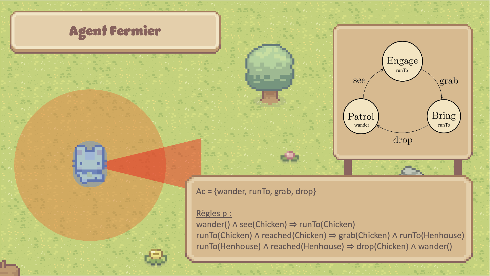
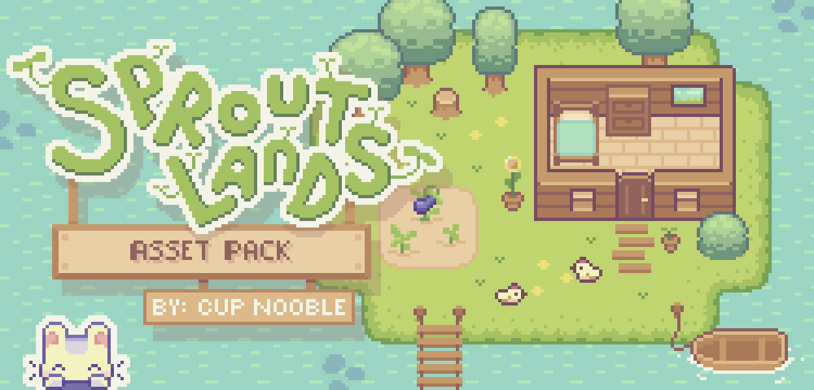

> The associated GitLab repository is available [here](https://gitlab.com/farmers3/chickenchase).

## Screenshots

Here are a screenshot of the game and some slides presenting the logic behind the agents.

