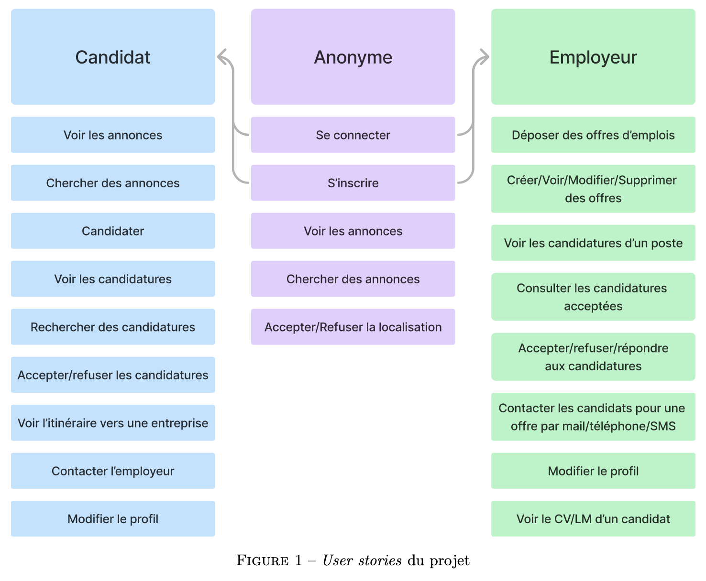
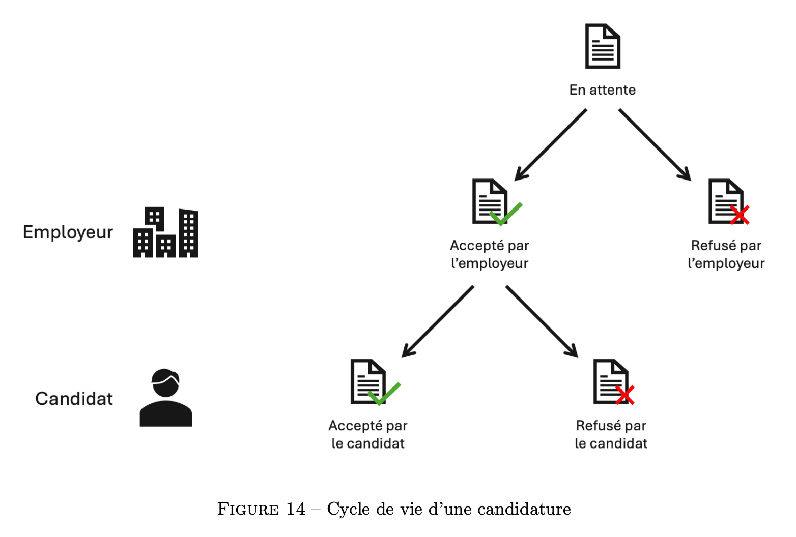
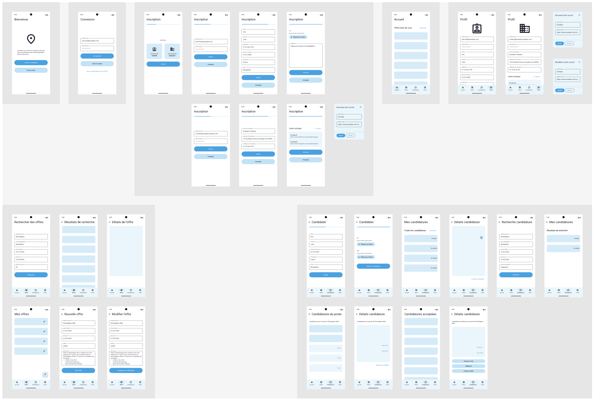
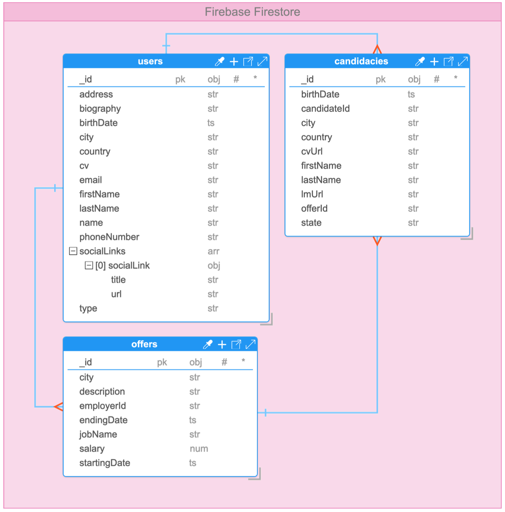
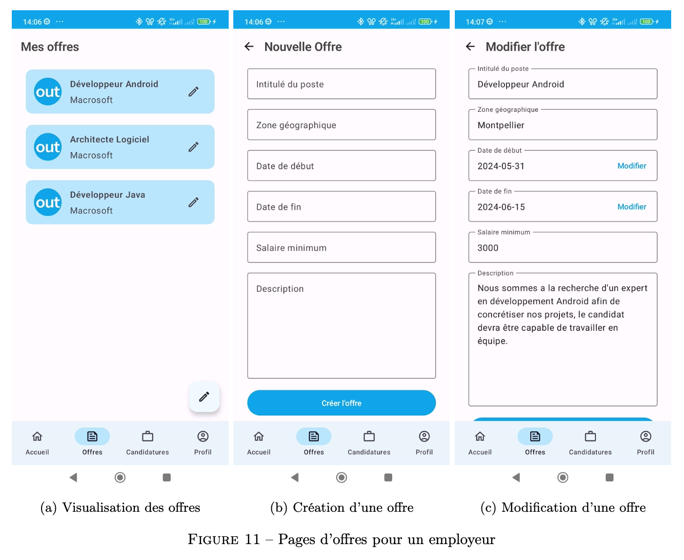
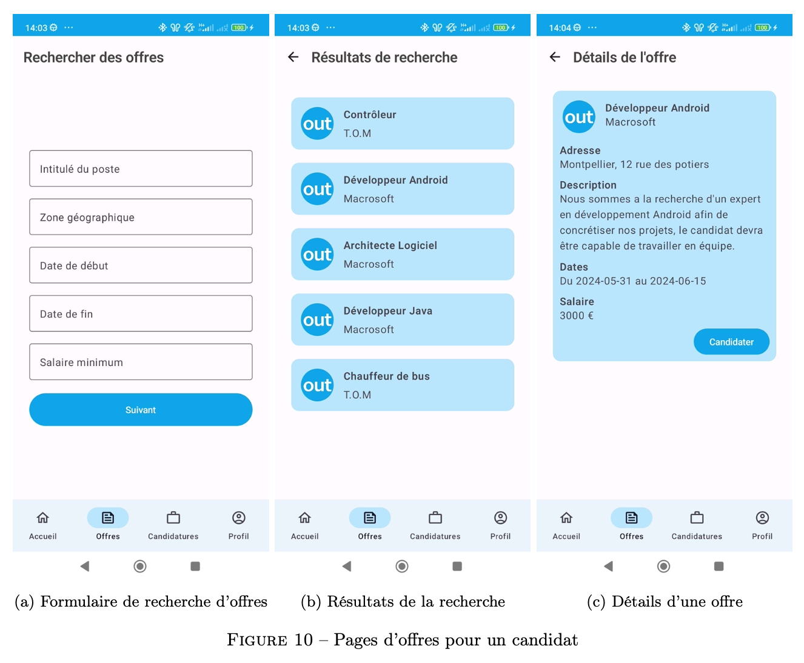

> Le dépôt GitLab est disponible [ici](https://gitlab.com/pablolaviron/linkedout).

## Images

Voici les _user stories_, un schéma global, notre prototype Figma, notre modèle de base de données et quelques captures d'écran de l'application.

