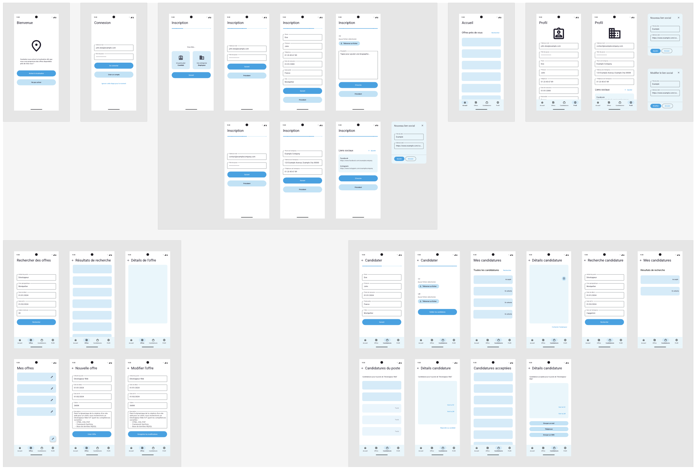
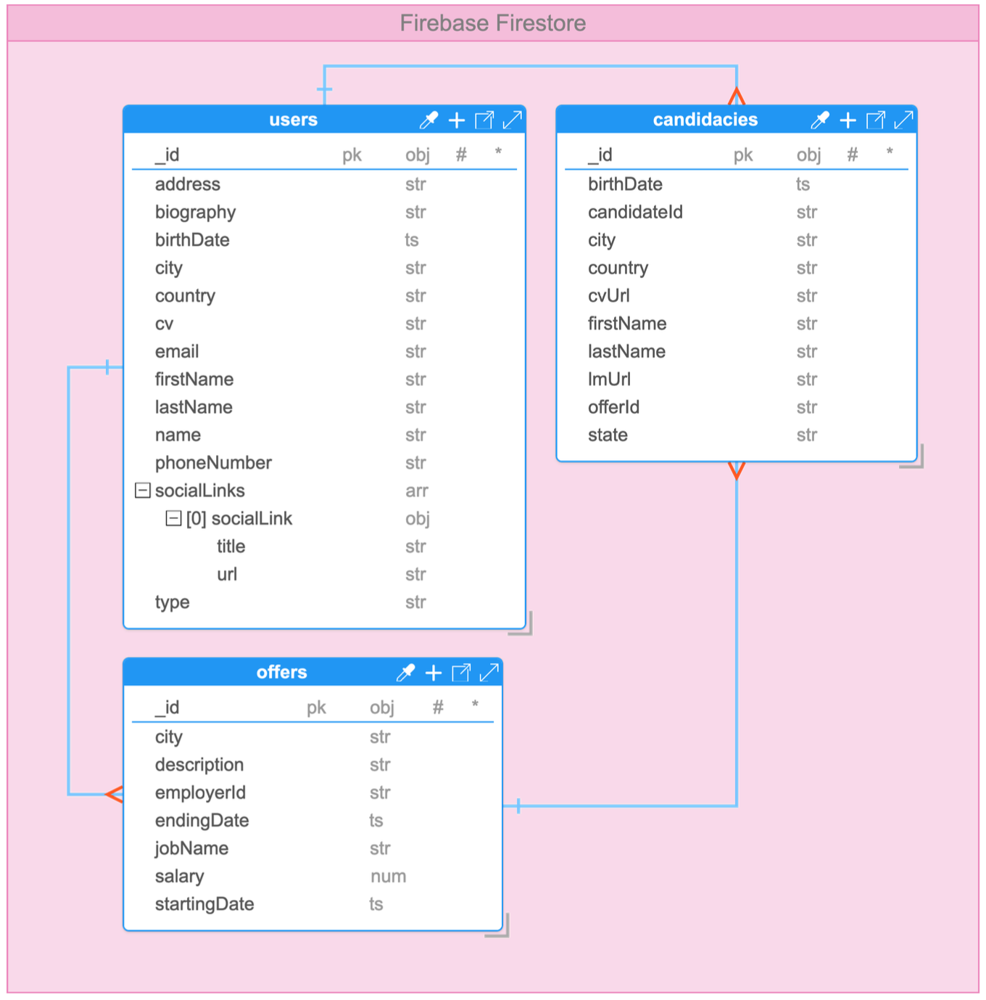
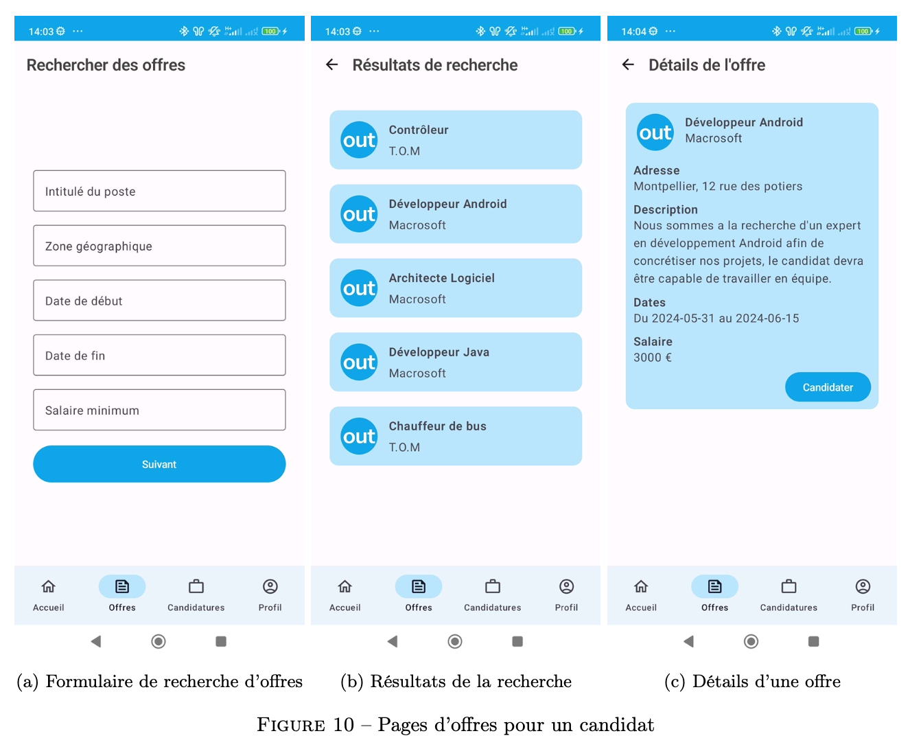

> The associated GitLab repository is available [here](https://gitlab.com/pablolaviron/linkedout).

## Images

Here are the user stories, a global diagram, our Figma prototype, our database model and some screenshots of the application.

