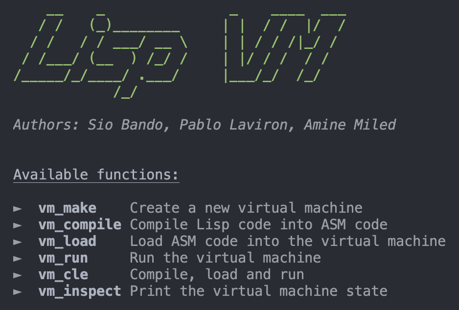
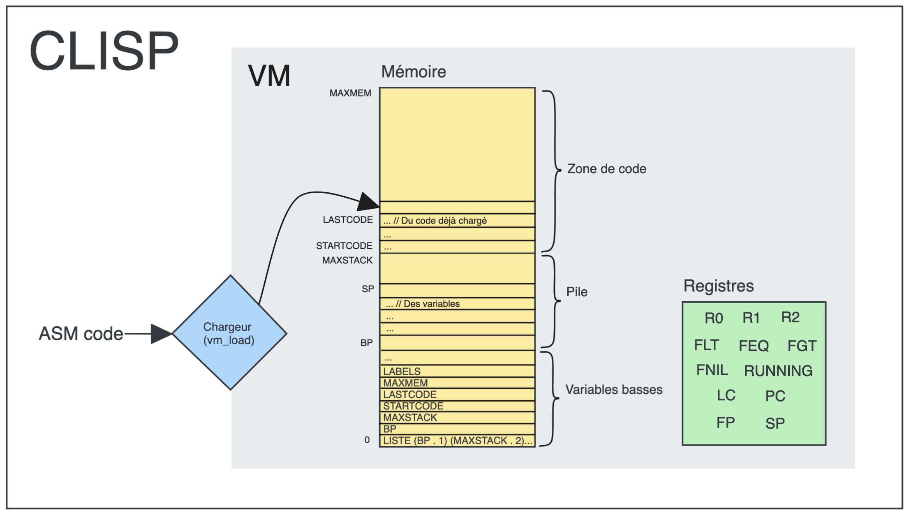
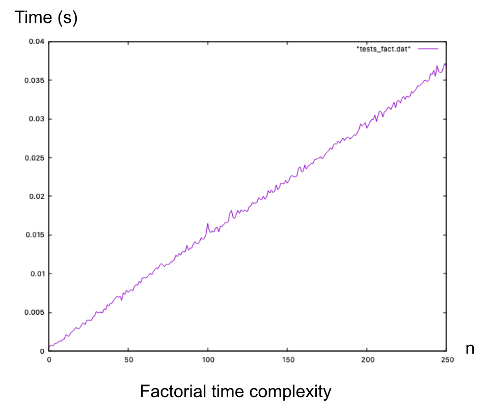
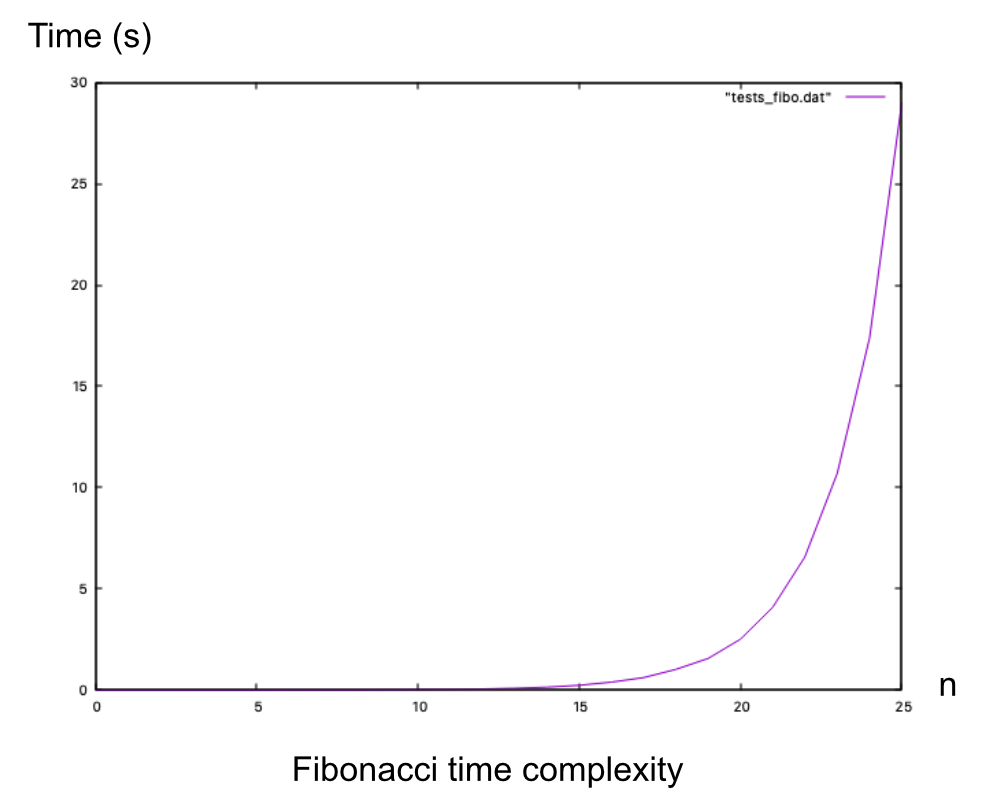

> The associated GitLab repository is available [here](https://gitlab.com/Muddinana/lisp_vm_compiler).

## Screenshots

Here are a screenshot of the CLI application, a diagram of the architecture and performance graphs.

