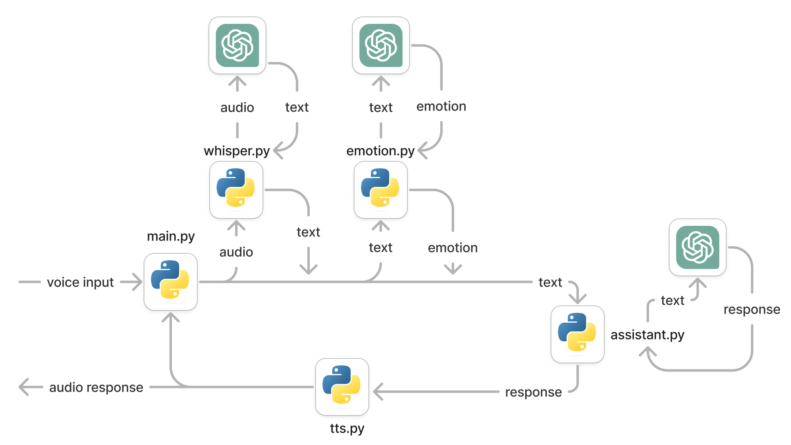
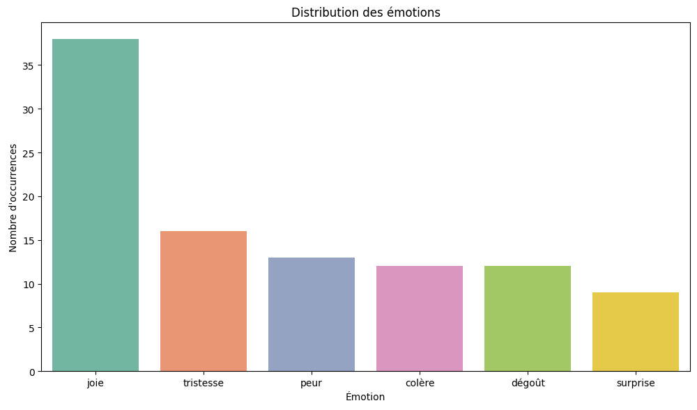
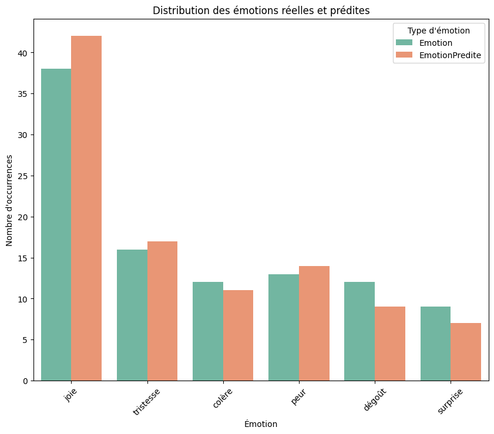

> Les dépôts GitLab sont disponibles [ici](https://gitlab.com/macrosoft-qt).

> Ce projet a été réalisé en collaboration avec le département robotique du [LIRMM](https://www.lirmm.fr/). L'article suivant a été publié :
>
> Croitoru, M. et al. (2025). _A Child-Robot Interaction Experiment to Analyze Gender Stereotypes in the Perception of Mathematical Abilities._ In: Bramer, M., Stahl, F. (eds) Artificial Intelligence XLI. SGAI 2024. Lecture Notes in Computer Science(), vol 15447. Springer, Cham. https://doi.org/10.1007/978-3-031-77918-3_17

## Images

Voici quelques images, schémas et graphiques de ce projet.

