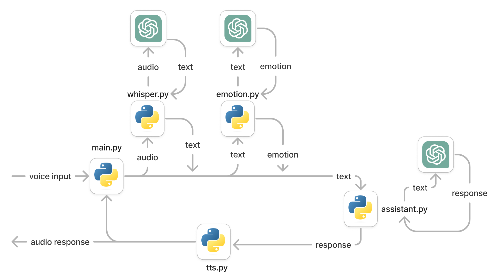
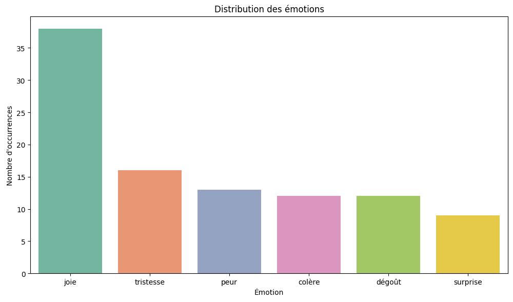
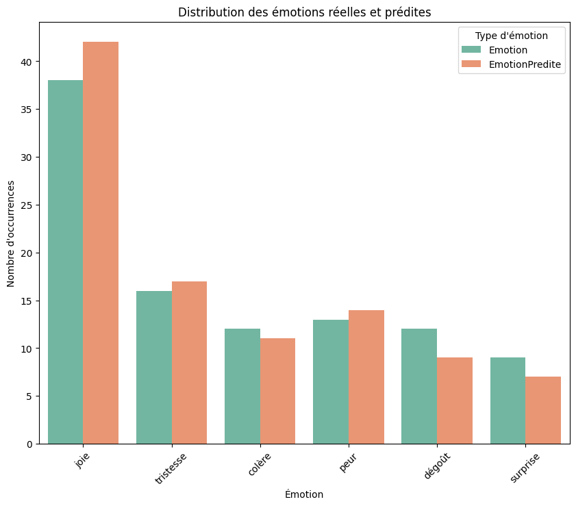
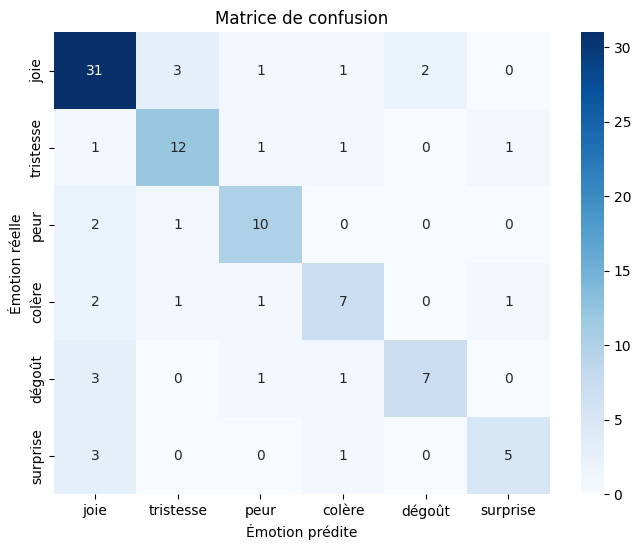

> The associated GitLab repositories are available [here](https://gitlab.com/macrosoft-qt).

> This project was done in collaboration with the [LIRMM](https://www.lirmm.fr/lirmm-en/)'s robotic department. The following article was published:
>
> Croitoru, M. et al. (2025). _A Child-Robot Interaction Experiment to Analyze Gender Stereotypes in the Perception of Mathematical Abilities._ In: Bramer, M., Stahl, F. (eds) Artificial Intelligence XLI. SGAI 2024. Lecture Notes in Computer Science(), vol 15447. Springer, Cham. https://doi.org/10.1007/978-3-031-77918-3_17

## Images

Here are some images, diagrams and charts about the project.

