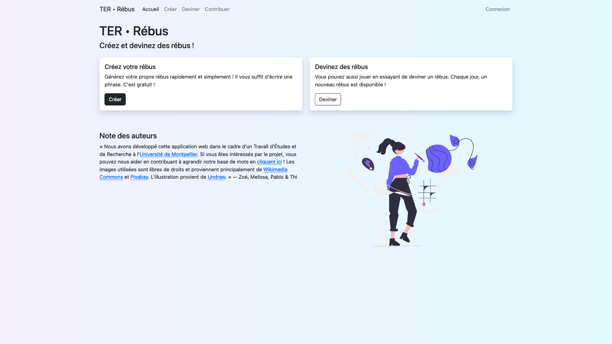
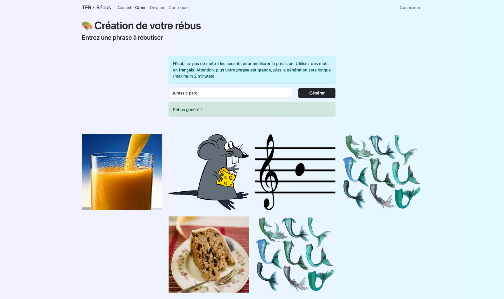
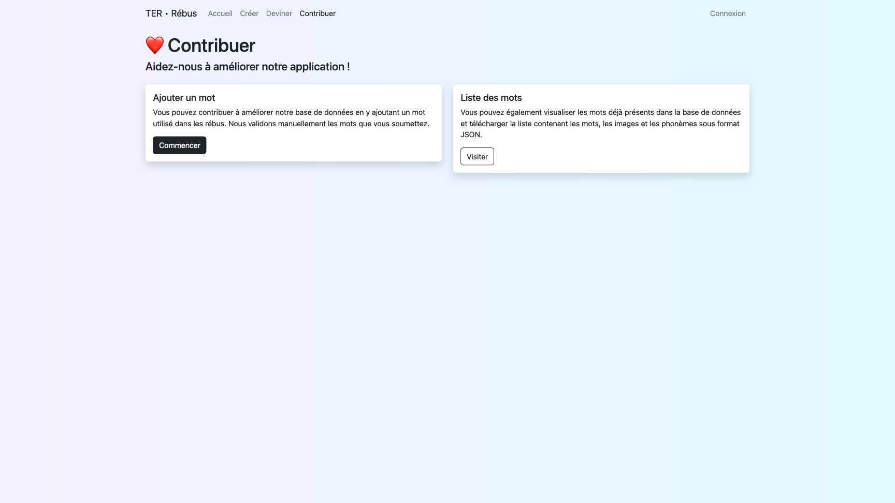
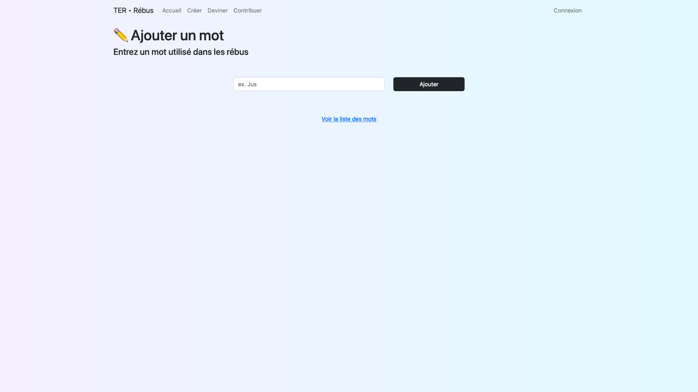
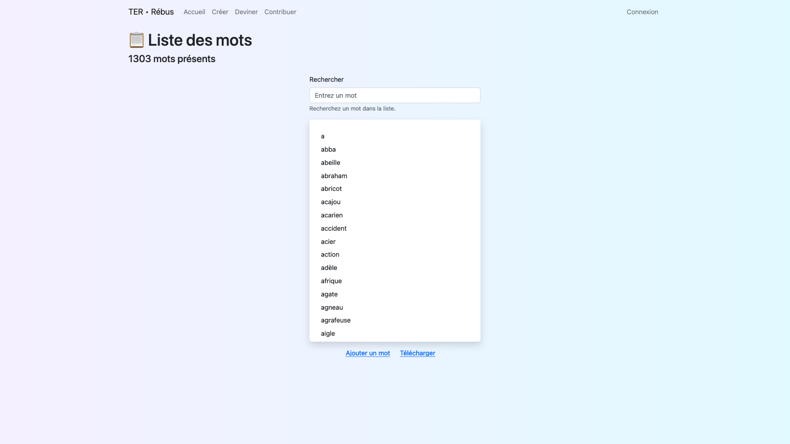
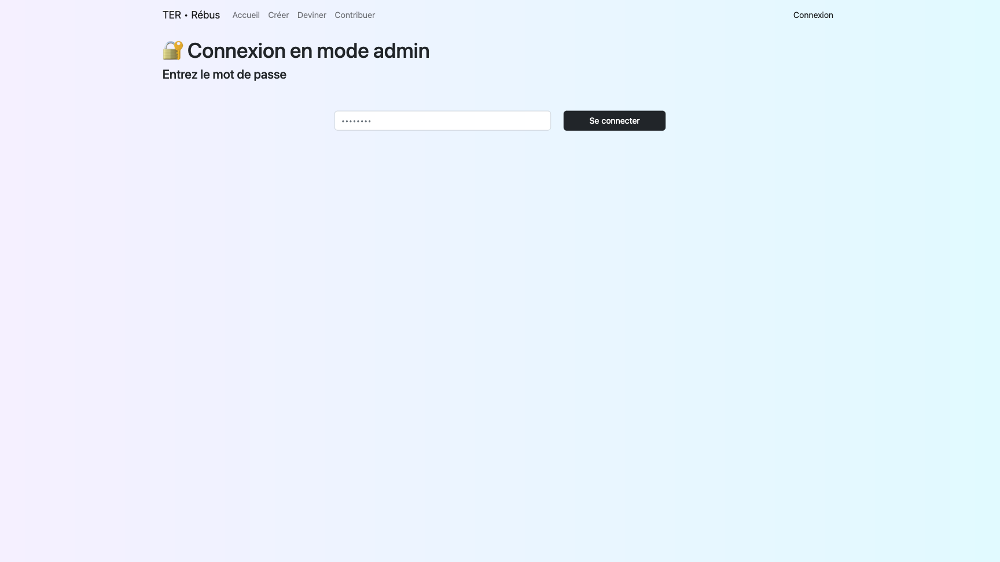
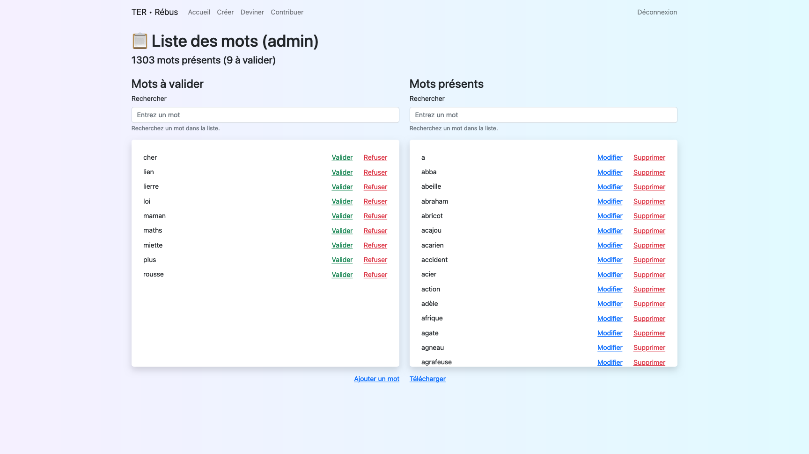

> Le dépôt GitLab du _frontend_ est disponible [ici](https://gitlab.com/pablolaviron/ter-rebus-frontend), et celui de l'API est disponible [ici](https://gitlab.com/thi-christine-nguyen/ter_rebus).
>
> L'application est déployée sur [terrebus.onrender.com](https://terrebus.onrender.com/).

## Captures d'écran

Voici quelques captures d'écran du site web.

