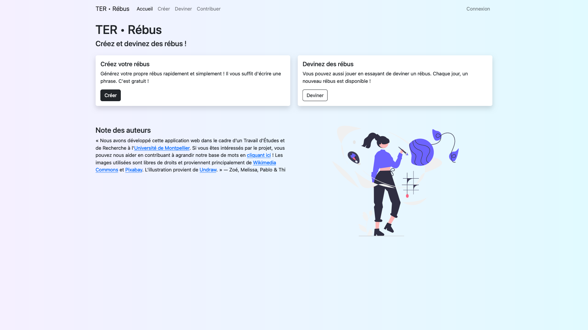
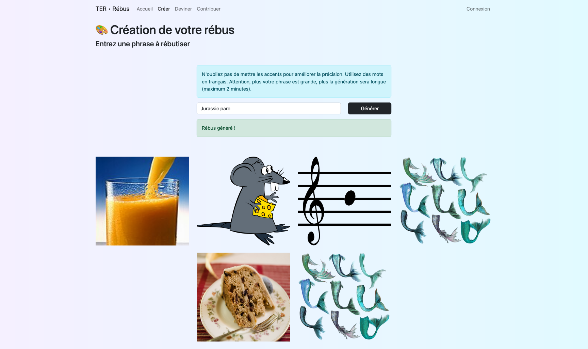
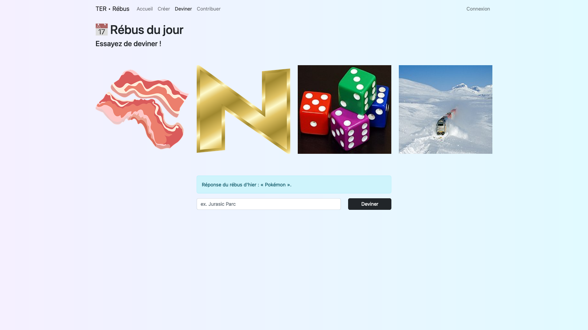

> The GitLab repository for the frontend is available [here](https://gitlab.com/pablolaviron/ter-rebus-frontend), and the one for the API can be found [here](https://gitlab.com/thi-christine-nguyen/ter_rebus).
>
> The application is deployed on [terrebus.onrender.com](https://terrebus.onrender.com/).

## Screenshots

Here are some screenshots of the website.

