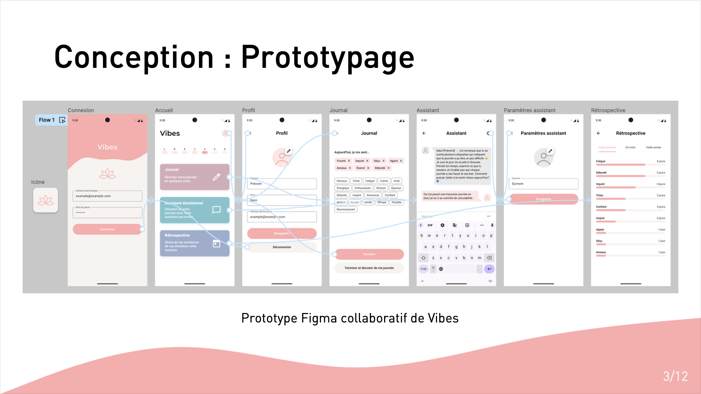
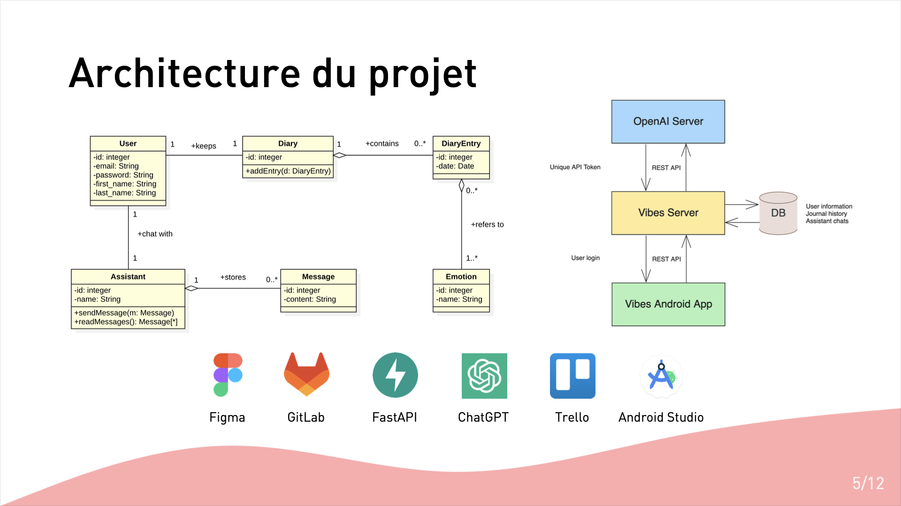
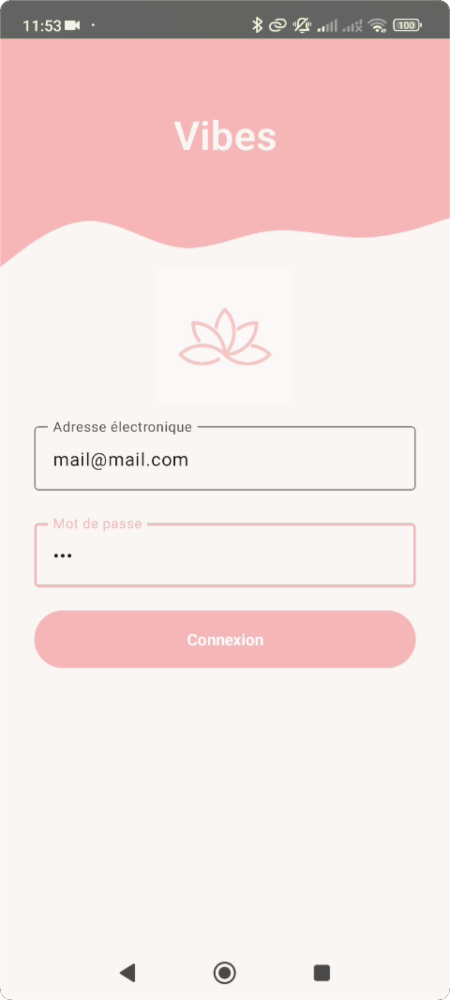
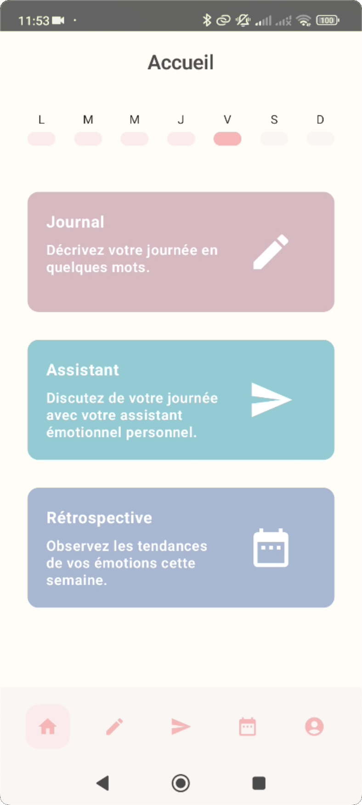
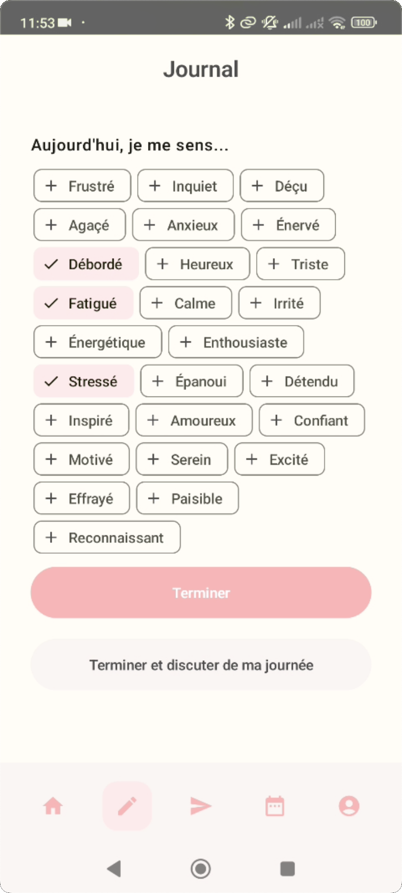
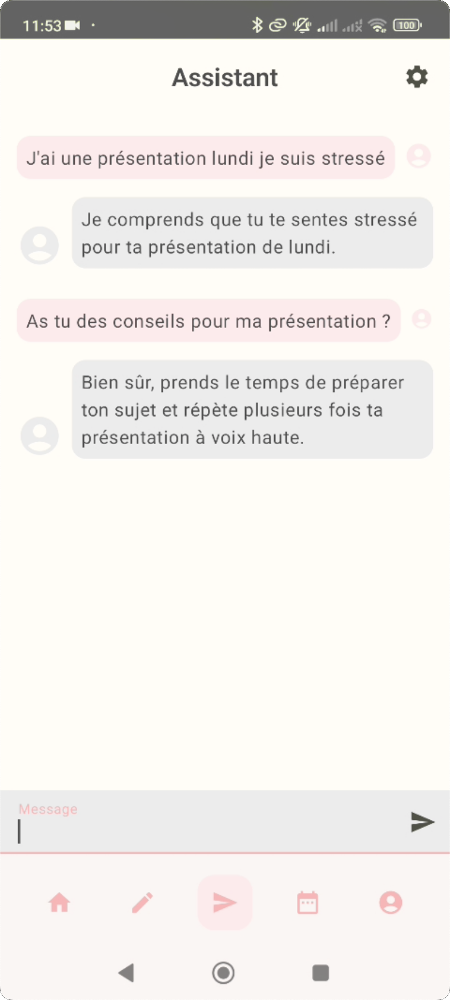
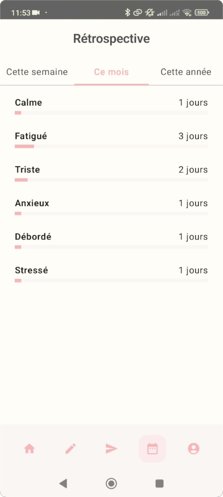

> Le dépôt GitLab du _frontend_ est disponible [ici](https://gitlab.com/app-vibes/vibesapp), et celui de l'API est disponible [ici](https://gitlab.com/app-vibes/vibes_api).

## Images

Voici quelques diapos illustrant notre prototype Figma et l'architecture du projet, ainsi que quelques captures d'écran de l'application.

|                        |                        |                        |                        |                        |
| :--------------------: | :--------------------: | :--------------------: | :--------------------: | :--------------------: |
|  |  |  |  |  |
