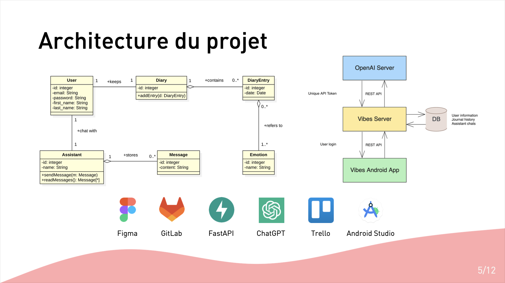
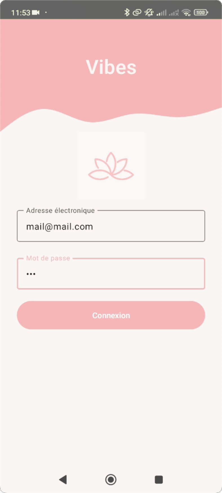
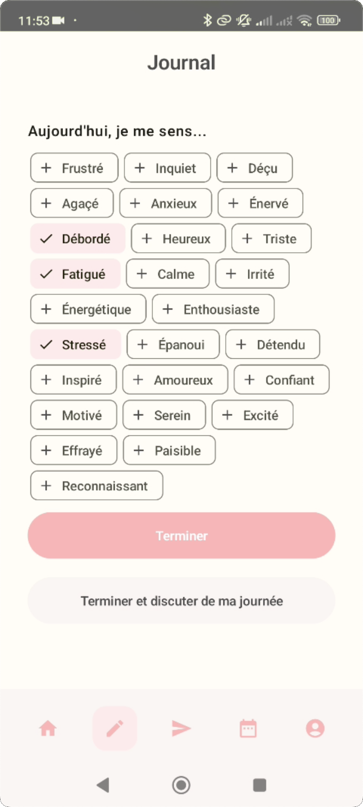
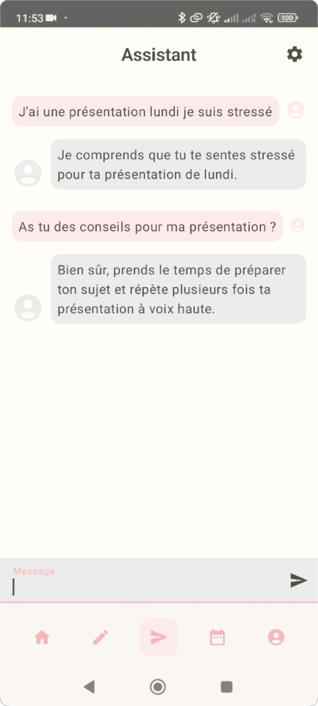
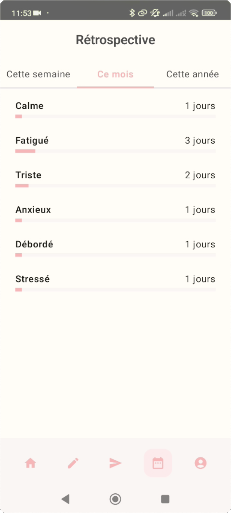

> The associated GitLab repository for the frontend is available [here](https://gitlab.com/app-vibes/vibesapp), and repository for the API is available [here](https://gitlab.com/app-vibes/vibes_api).

## Images

Here are some slides about our Figma prototype and the project architecture, as well as some screenshots of the application.

|                        |                        |                        |                        |                        |
| :--------------------: | :--------------------: | :--------------------: | :--------------------: | :--------------------: |
|  |  |  |  |  |
